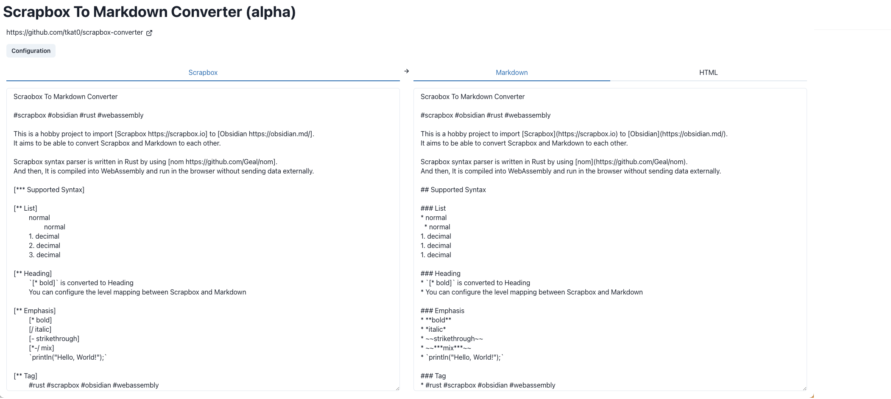

# Scrapbox Converter

[Scrapbox](https://scrapbox.io/) converter written in Rust

This is a hobby project to import Scrapbox to [Obsidian](https://obsidian.md/).
It aims to be able to convert Scrapbox and Markdown to each other.

## Demo

https://tkat0.github.io/scrapbox-converter/

**Note: This is still in early alpha and is subject to change at any time!**

## References

-   [Syntax - Scrapbox Help](https://scrapbox.io/help/Syntax)
